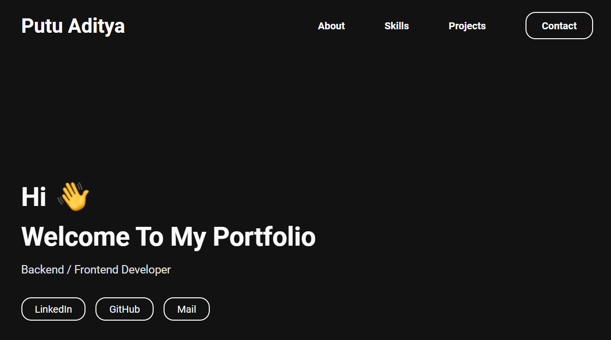

# putuadityabayu.github.io

#### My Portfolio Website.

putuadityabayu.github.io is an open sources NodeJs application for my portfolio websites build with GatsbyJs and [Portfolio Minimal](https://github.com/konstantinmuenster/gatsby-theme-portfolio-minimal/tree/main/gatsby-theme-portfolio-minimal#readme).

[Live Websites](https://aditya.portalnesia.com)

Just clone this Repository, add/edit the content. And that's it!

By default, this repository has a `content` directory at the root of your Gatsby site. There, you can edit the theme settings as well as add content for your sections. To learn more about it, have a look at the [Readme of Portfolio Minimal](https://github.com/konstantinmuenster/gatsby-theme-portfolio-minimal/tree/main/gatsby-theme-portfolio-minimal#readme).

---

## Installation

1. Clone This Repository

2. Install Gatsby CLI

   ```sh
   npm install -g gatsby-cli
   ```

3. Install Depedencies

   ```sh
   npm install
   ```

4. Once installed, you can begin developing your site.

   ```sh
   npm run dev
   ```
